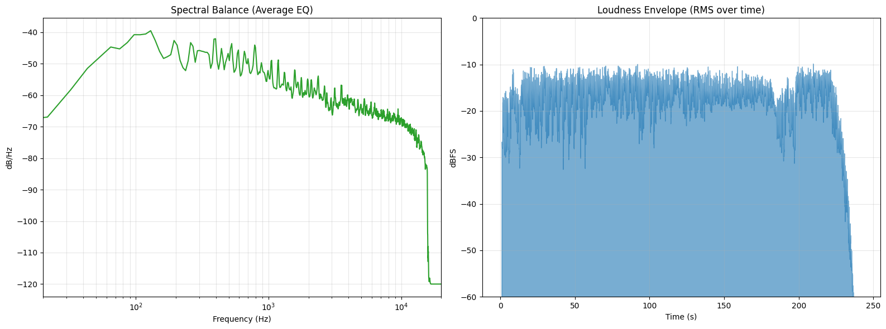

# Acoustic Report Engine

Made in response to the White Sea Studios request in this video: https://youtu.be/zbv2V86R_hE?t=450

## Project Description

This repository contains an "Acoustic Report Engine" (ARE) that generates objective technical reports for audio tracks, focusing on average spectral balance, loudness, and dynamics. The tool is configured with a reference alignment of 0 VU = -18 dBFS and follows ITU-R BS.1770-4 loudness measurement standards.

## Sample Technical Output

```
=============================================
Technical Audio Report: Van Halen - Jump (Official Music Video) [HD].mp3
---------------------------------------------
Integrated Loudness:  -15.40 LUFS
Short-term Max:       -12.93 LUFS
Momentary Max:        -11.32 LUFS
Loudness Range (LRA):   0.00 LU

True Peak:            -0.62 dBTP (ITU BS.1770)
Sample Peak:          -0.68 dBFS

VU Average:           -2.65 VU (Ref: -18 dBFS)
VU Maximum:            6.79 VU
=============================================
```

## Graphical Analysis

The engine also produces time–frequency visualizations to complement the numeric report:

- **Spectral Balance (Average EQ)** — frequency response plotted in dB/Hz vs logarithmic frequency (Hz), showing the long‑term tonal balance of the program material.
- **Loudness Envelope (RMS over time)** — RMS loudness (dBFS) vs time (seconds), illustrating level stability, macro‑dynamics, and any large‑scale level changes across the song.
  


## Intended Use

The ARE is designed as a neutral analysis tool for comparing mixes and masters, calibrating monitoring decisions, and documenting objective characteristics of commercial references or work‑in‑progress material in response to feedback such as that from White Sea Studios. Free under MIT lisence.
